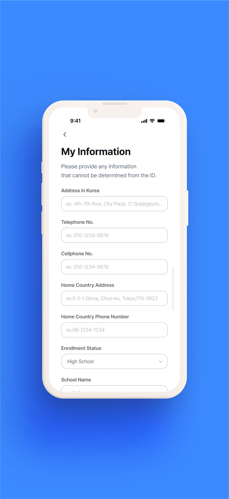

# Woorinara App - Modern iOS Application


## 🎯 Overview

Woorinara App is an innovative iOS application designed specifically for foreign residents in Korea. The app streamlines complex bureaucratic processes by providing intelligent document processing, real-time translation, and automated form filling capabilities.
## ✨ Features

### 🎯 Core Functionality

#### Document Processing & OCR
- **Smart Document Scanner**: Advanced OCR technology to extract text from Korean government documents
- **Multi-format Support**: Process PDFs, images, and physical documents via camera
- **Accuracy Optimization**: Enhanced recognition for Korean, English, Chinese characters
- **Field Detection**: Automatic identification of form fields and required information

#### AI-Powered Assistance
- **OpenAI GPT Integration**: Intelligent form completion suggestions and guidance
- **Context-Aware Help**: Real-time assistance based on form type and user situation
- **Error Prevention**: Proactive validation to prevent common mistakes
- **Smart Recommendations**: Suggests relevant documents based on user needs

#### Multi-Language Support
- **Real-time Translation**: Instant translation of Korean government documents
- **Supported Languages**: Korean, English, Chinese, Vietnamese, and more
- **Contextual Translation**: Accurate translation of legal and administrative terms
- **Bilingual Display**: Side-by-side view of original and translated content

#### Form Management
- **Auto-Fill Technology**: Automatically populate forms using saved user profile
- **Form Templates**: Pre-configured templates for common applications
- **Progress Tracking**: Visual indicators showing completion status
- **Draft Saving**: Save incomplete forms and resume later
- **History Management**: Access previously submitted forms

### 💻 Technical Implementation

#### Architecture & Design Patterns
- **MVVM Architecture**: Clean separation of business logic and UI
- **Coordinator Pattern**: Centralized navigation management
- **Repository Pattern**: Abstracted data layer for flexibility
- **Dependency Injection**: Improved testability and modularity
- **Protocol-Oriented Programming**: Extensive use of protocols for flexibility

#### iOS Technologies
- **SwiftUI**: 100% SwiftUI implementation for modern UI
- **Combine Framework**: Reactive programming for data flow
- **Vision Framework**: Advanced OCR and document detection
- **Core Data**: Local persistence for user data and forms
- **Keychain Services**: Secure storage of sensitive information

#### Networking & APIs
- **URLSession**: Modern networking with async/await
- **REST API Integration**: Seamless backend communication
- **OpenAI API**: GPT model integration for intelligent features
- **Error Handling**: Comprehensive error handling and retry logic
- **Offline Mode**: Core features available without internet

#### Security & Privacy
- **Biometric Authentication**: Face ID/Touch ID support
- **Data Encryption**: AES encryption for sensitive data
- **Secure Communication**: Certificate pinning for API calls
- **Privacy-First Design**: Minimal data collection, local processing when possible
- **GDPR Compliance**: Full compliance with privacy regulations

### 📱 User Experience

#### Interface Design
- **Intuitive Navigation**: Tab-based interface with clear user flow
- **Modern UI/UX**: Clean, minimalist design following iOS HIG
- **Dark Mode**: Full support for light and dark appearance
- **Responsive Layout**: Optimized for all iPhone and iPad sizes
- **Smooth Animations**: Fluid transitions and micro-interactions

#### Accessibility
- **VoiceOver Support**: Complete screen reader compatibility
- **Dynamic Type**: Support for all text size preferences
- **Color Contrast**: WCAG AA compliant color schemes
- **Reduced Motion**: Respects user motion preferences
- **Haptic Feedback**: Tactile feedback for important actions

#### Performance
- **Fast Launch Time**: <1.5 seconds cold start
- **Memory Efficient**: <50MB average memory usage
- **Battery Optimized**: Minimal battery impact
- **60fps Scrolling**: Smooth performance throughout
- **Image Caching**: Intelligent caching for faster load times

### 🔧 Development Features

#### Testing & Quality
- **Unit Tests**: >70% code coverage for business logic
- **UI Tests**: Automated testing for critical user flows
- **Integration Tests**: API and service layer testing
- **Performance Tests**: Monitoring for regressions
- **SwiftLint Integration**: Consistent code style enforcement

#### CI/CD & DevOps
- **GitHub Actions**: Automated build and test pipeline
- **Fastlane Integration**: Automated deployment to TestFlight
- **Code Signing**: Automated certificate management
- **Version Management**: Semantic versioning
- **Crash Reporting**: Real-time crash analytics

#### Documentation
- **Inline Documentation**: Comprehensive code comments
- **API Documentation**: Complete API reference
- **Architecture Decisions**: ADR documentation
- **User Guides**: In-app help and tutorials
- **Developer Guide**: Setup and contribution guidelines

### 🌟 Unique Selling Points

#### For Foreign Residents
- **Bureaucracy Simplified**: Complex processes made simple
- **Language Barrier Removed**: No Korean knowledge required
- **Time Saving**: Hours of work reduced to minutes
- **Error Reduction**: Minimize form rejection rates
- **24/7 Availability**: Get help anytime, anywhere

#### For Developers (Portfolio Perspective)
- **Real-World Problem Solving**: Addresses genuine user needs
- **Technical Excellence**: Modern Swift and iOS best practices
- **Scalable Architecture**: Enterprise-ready code structure
- **Innovation**: Creative use of AI and OCR technologies
- **User-Centric Design**: Focus on accessibility and usability

### 🚀 Future Enhancements (Roadmap)

#### Planned Features
- **Digital Wallet**: Store and manage digital copies of documents
- **Appointment Booking**: Direct integration with government offices
- **Push Notifications**: Reminders for document renewals
- **Widget Support**: Quick access via iOS widgets
- **Apple Watch App**: Companion app for quick reference

#### Technical Improvements
- **SwiftData Migration**: Adopt Apple's latest persistence framework
- **Async Sequences**: Enhanced streaming capabilities
- **Server-Driven UI**: Dynamic form generation
- **ML Models**: On-device machine learning for better predictions
- **CloudKit Sync**: Multi-device synchronization


## 🏗 Architecture

```
Woorinara_app/
├── Core/
│   ├── Models/          # Data models
│   ├── Views/           # SwiftUI views  
│   ├── ViewModels/      # MVVM view models
│   ├── Services/        # API and business logic
│   └── Utilities/       # Helpers and extensions
├── Features/
│   ├── Chat/            # AI assistant module
│   ├── Scanner/         # Document scanning
│   ├── Forms/           # Form processing
│   ├── Translation/     # Translation services
│   └── Community/       # Forum features
└── Resources/           # Assets and localization
└── SupportingFiles/     # Configuration files
```

### Design Patterns & Best Practices

- **MVVM (Model-View-ViewModel)**: For clean separation of UI and business logic
- **Repository Pattern**: For data access abstraction
- **Dependency Injection**: For testability and modularity
- **Coordinator Pattern**: For navigation flow management
- **Protocol-Oriented Programming**: Extensive use of protocols for flexibility

## 🚀 Getting Started

### Prerequisites

- Xcode 15.0+
- iOS 16.0+
- Swift 5.9+
- CocoaPods or Swift Package Manager

### Installation

1. Clone the repository:
```bash
git clone https://github.com/Minapak/Woorinara_app.git
cd Woorinara_app
```

2. Install dependencies:
```bash
# If using CocoaPods
pod install

# If using Swift Package Manager
# Dependencies will be resolved automatically when opening in Xcode
```

3. Configuration:
   - Copy `Config.example.plist` to `Config.plist`
   - Add your API keys to `Config.plist`
   - Never commit `Config.plist` to version control

4. Open the project:
```bash
open Woorinara_app.xcworkspace
# or
open Woorinara_app.xcodeproj
```

5. Build and run (⌘+R)

## 🔧 Configuration

### API Keys Setup

The app requires the following API keys:

1. **OpenAI API Key**: For GPT integration
   - Get it from [OpenAI Platform](https://platform.openai.com/api-keys)

2. **AppsFlyer SDK Key**: For analytics (optional)
   - Available from AppsFlyer Dashboard

Store these securely in `Config.plist` or use environment variables.

### Environment Variables

For CI/CD, set these environment variables:
```bash
export OPENAI_API_KEY="your-api-key"
export APPS_FLYER_KEY="your-key"
```

## 🧪 Testing

### Unit Tests
```bash
xcodebuild test -scheme Woorinara_app -destination 'platform=iOS Simulator,name=iPhone 15 Pro'
```

### UI Tests
```bash
xcodebuild test -scheme Woorinara_appUITests -destination 'platform=iOS Simulator,name=iPhone 15 Pro'
```

### Code Coverage
The project maintains >70% code coverage for business logic components.

## 📱 Screenshots

<p align="center">
  
  
  
  <br>
  
  
  
  <br>
  
  
  
</p>
<p align="center">
  <sub>Foreign Resident Civil Service Helper - Simplifying bureaucratic processes for foreigners in Korea</sub>
</p>

## 🛠 Technical Skills Demonstrated

### iOS Development
- **SwiftUI & Combine**: Modern declarative UI and reactive programming
- **UIKit Integration**: Bridging with UIKit when necessary
- **Core Data**: Local data persistence
- **Core Animation**: Smooth, custom animations

### Networking & APIs
- **URLSession**: Advanced networking with async/await
- **REST APIs**: Complete CRUD operations
- **WebSocket**: Real-time communication (if applicable)
- **JSON Parsing**: Codable protocol implementation

### Architecture & Patterns
- **MVVM + Coordinator**: Scalable app architecture
- **Dependency Injection**: Using property wrappers
- **Protocol-Oriented Programming**: Extensive protocol usage
- **SOLID Principles**: Clean, maintainable code

### Security
- **Keychain Services**: Secure credential storage
- **Biometric Authentication**: Face ID/Touch ID integration
- **Certificate Pinning**: Enhanced API security
- **Data Encryption**: AES encryption for sensitive data

## 📊 Performance Metrics

- **Launch Time**: <1.5 seconds
- **Memory Usage**: <50MB average
- **Battery Impact**: Minimal
- **Network Optimization**: Caching & compression
- **Frame Rate**: Consistent 60fps

## 🔐 Security Features

- API keys stored securely in Keychain
- No hardcoded credentials
- Certificate pinning for API calls
- Biometric authentication support
- Encrypted local storage

## 📈 Analytics & Monitoring

- Performance monitoring
- Crash reporting
- User analytics (privacy-compliant)
- A/B testing capability

## 🤝 Contributing

Feedback and suggestions are welcome! Please feel free to:

1. Fork the repository
2. Create a feature branch
3. Submit a pull request
4. Report issues

See [CONTRIBUTING.md](CONTRIBUTING.md) for details.

## 📄 License

This project is licensed under the MIT License - see the [LICENSE](LICENSE) file for details.

## 👨‍💻 Author

**EUNMIN PARK**
- 📧 Email: dmsals2008@gmail.com
- 💼 LinkedIn: [linkedin.com/in/eunmin-park-284346341](https://linkedin.com/in/eunmin-park-284346341)


## 🙏 Acknowledgments

- OpenAI for providing the GPT API
- Apple Developer Documentation
- SwiftUI Community
- Stack Overflow Community

## 📚 Resources

- [Project Documentation](Documentation/)
- [API Documentation](Documentation/API.md)
- [Architecture Decision Records](Documentation/ADR/)

---

<p align="center">
  Made with ❤️ using Swift and SwiftUI
</p>

<p align="center">
  <a href="https://github.com/Minapak/Woorinara_app">
    
  </a>
  <a href="https://github.com/Minapak/Woorinara_app/fork">
    
  </a>
</p>
