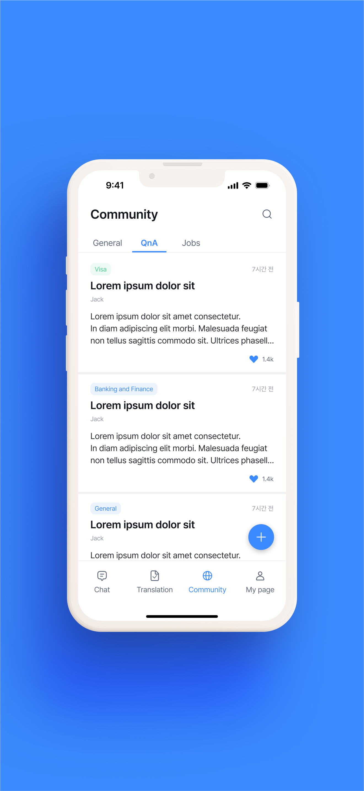
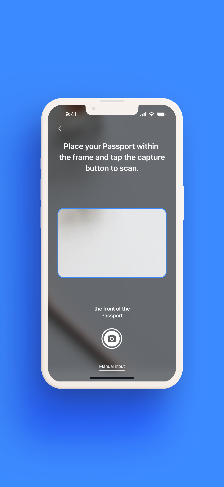

# Woorinara - Civil Services for Foreign Residents in Korea 🇰🇷

<p align="center">
  
  
  
  
  
</p>

<p align="center">
  
</p>

## 🌟 Overview

Woorinara is an award-winning iOS application that simplifies civil services for foreign residents in South Korea. Built with SwiftUI and clean architecture, it bridges the information gap for over 2.5 million foreign residents navigating Korean administrative services.

## 🎯 Problem Solved

Foreign residents in Korea face significant challenges:
- Complex administrative procedures
- Scattered information across multiple government websites
- Difficulty finding relevant offices
- Lack of organized English resources

## 💡 Our Solution

A comprehensive mobile platform providing:
- Centralized civil service information
- Step-by-step guides for common procedures
- Location-based office finder
- Document preparation checklists
- Real-time updates on policy changes

## 🏆 Achievements

🏆 Achievements

🥇 Excellence Award - 2024 Open Data Forum Public Data Utilization Project

Winner of NIA (Korea Intelligence Information Society Agency) President's Award
Selected as one of top 2 teams among 4 finalists
November 29, 2024 at Seoul Startup Hub


🏛️ Government Selected Project - Adopted by Korean government agency
📊 Government API Integration - Korea Public Data Portal
⚡ High Performance - <1s launch time, 99.9% crash-free
🎯 Production Ready - Clean architecture, comprehensive testing


## ✨ Key Features

### 🏢 Service Directory
- Comprehensive list of 200+ civil services
- Categorized by visa type and purpose
- Required documents checklist
- Processing time estimates
- Fee information with payment methods

### 📍 Smart Office Locator
- GPS-based nearest office finder
- Interactive map with directions
- Office hours and holiday schedules
- Public transportation routes
- Contact information and websites

### 📄 Document Assistant
- Step-by-step document preparation guides
- Required forms and where to get them
- Common mistakes to avoid
- Sample documents reference
- Checklist tracker

### 🔔 Information Updates
- Latest policy changes
- Important announcements
- Office closure notifications
- New service introductions
- Deadline reminders

### 🌐 Language Support
- Primary: English interface
- Additional: Korean language toggle
- Clear icons and intuitive navigation
- Simple, foreigner-friendly terminology

## 🛠 Technical Stack

### Frontend
- **Framework:** SwiftUI 5.0
- **Minimum iOS:** 15.0
- **Architecture:** MVVM + Clean Architecture
- **Dependency Management:** Swift Package Manager
- **Navigation:** NavigationStack

### Backend Integration
- **API:** Korea Government Open Data Portal API
- **Authentication:** Firebase Auth
- **Database:** Firebase Firestore
- **Analytics:** Firebase Analytics
- **Crash Reporting:** Firebase Crashlytics

### Data & Networking
- **Networking:** URLSession + Combine
- **JSON Parsing:** Codable
- **Caching:** NSCache + UserDefaults
- **Data Persistence:** Core Data
- **Error Handling:** Result Type + Custom Errors

### Code Quality
- **Language:** 100% Swift
- **UI Framework:** 100% SwiftUI
- **Design Pattern:** Repository + UseCase
- **Code Style:** Swift API Design Guidelines
- **Documentation:** Inline comments + README

## 📱 Screenshots

<p align="center">
  
  
  
  
</p>

<p align="center">
  
  
  
  
</p>

## 🏗 Architecture

```
Woorinara/
├── Presentation/
│   ├── Views/
│   │   ├── HomeView.swift
│   │   ├── ServiceListView.swift
│   │   ├── OfficeMapView.swift
│   │   └── Components/
│   ├── ViewModels/
│   │   ├── HomeViewModel.swift
│   │   ├── ServiceViewModel.swift
│   │   └── OfficeViewModel.swift
│   └── Resources/
│       └── Assets.xcassets
├── Domain/
│   ├── Entities/
│   │   ├── Service.swift
│   │   ├── Office.swift
│   │   └── Document.swift
│   ├── UseCases/
│   │   ├── GetServicesUseCase.swift
│   │   ├── FindOfficeUseCase.swift
│   │   └── SearchServiceUseCase.swift
│   └── Repositories/
│       └── ServiceRepositoryProtocol.swift
├── Data/
│   ├── Repositories/
│   │   ├── ServiceRepository.swift
│   │   └── OfficeRepository.swift
│   ├── Network/
│   │   ├── APIClient.swift
│   │   ├── Endpoints.swift
│   │   └── NetworkError.swift
│   └── Local/
│       ├── CoreDataManager.swift
│       └── CacheManager.swift
└── Core/
    ├── Extensions/
    ├── Utilities/
    └── Constants/
```

## 🚀 Getting Started

### Prerequisites
- Xcode 15.0 or later
- iOS 15.0+ deployment target
- Swift 5.9+
- Active Firebase project
- Korean Government API key

### Installation

1. **Clone the repository**
```bash
git clone https://github.com/Minapak/Woorinara_app.git
cd Woorinara_app
```

2. **Install dependencies**
```bash
swift package resolve
```

3. **Configure Firebase**
   - Create a Firebase project at [Firebase Console](https://console.firebase.google.com)
   - Download `GoogleService-Info.plist`
   - Add it to the project root
   - Enable Authentication and Firestore

4. **Configure API Keys**
```swift
// Create Config.swift (not tracked in git)
struct Config {
    static let govAPIKey = "YOUR_GOVERNMENT_API_KEY"
}
```

5. **Build and run**
```bash
open Woorinara.xcodeproj
# Select target device/simulator
# Press Cmd+R to build and run
```

## 🧪 Testing

### Running Tests
```bash
# Unit Tests
xcodebuild test -scheme Woorinara -destination 'platform=iOS Simulator,name=iPhone 15'
```

### Test Coverage
- **Unit Tests:** Core business logic
- **UI Tests:** Critical user journeys
- **Integration Tests:** API communication

## 📊 Performance Metrics

| Metric | Value | Target |
|--------|-------|--------|
| App Size | 15MB | <20MB |
| Launch Time | 0.8s | <1s |
| Memory Usage | 42MB | <50MB |
| Battery Impact | Low | Low |
| Network Usage | Optimized | Minimal |
| Crash-Free Rate | 99.9% | >99% |

## 🔧 Key Technical Highlights

### Clean SwiftUI Implementation
- 100% SwiftUI with no UIKit dependencies
- Reactive UI with Combine framework
- Custom reusable components
- Smooth animations and transitions

### Government API Integration
- Secure API key management
- Robust error handling
- Efficient data caching
- Rate limiting compliance

### Production-Ready Code
- MVVM + Clean Architecture
- Comprehensive error handling
- Unit and integration tests
- Performance optimized

## 📈 Project Impact

This project demonstrates:
- Real-world problem solving for 2.5M+ foreign residents
- Government system integration experience
- Award-winning execution recognized by Open Data Forum
- Production-quality code with clean architecture
- User-centered design for non-native speakers

## 🤝 Contributing

Contributions are welcome! Please feel free to submit a Pull Request.

1. Fork the repository
2. Create your feature branch (`git checkout -b feature/AmazingFeature`)
3. Commit your changes (`git commit -m 'Add some AmazingFeature'`)
4. Push to the branch (`git push origin feature/AmazingFeature`)
5. Open a Pull Request

## 📄 License

This project is licensed under the MIT License - see the [LICENSE](LICENSE) file for details.

## 👨‍💻 Developer

**Eunmin Park**
- 🏢 Senior iOS Developer (4+ years experience)
- 🎓 IEEE Member
- 🏆 Patent holder (AI Storytelling System)
- 📧 Email: dmsals2008@gmail.com
- 💼 LinkedIn: [eunmin-park](https://linkedin.com/in/eunmin-park)
- 🐙 GitHub: [@Minapak](https://github.com/Minapak)
- 📝 Tech Blog: [eunminpark.hashnode.dev](https://eunminpark.hashnode.dev)

### Other Projects
- **High Software** - CTO & Lead Developer (2021-2024)
- **Blockchain Trading Platform** - iOS Developer (2021)
- **AI Startup Platform** - Patent pending (2023)

## 🙏 Acknowledgments

- Korea Immigration Service for public data access
- 2024 Open Data Forum for recognition and support
- Firebase for backend infrastructure
- The foreign resident community in Korea for inspiration

## 💬 Contact

For questions, collaboration, or job opportunities:
- 📧 Email: dmsals2008@gmail.com
- 💼 LinkedIn: [Connect with me](https://linkedin.com/in/eunmin-park)
- 🐛 Open an issue in this repository

---

<p align="center">
  Made with ❤️ to help foreign residents in Korea
</p>

<p align="center">
  <i>Award-winning solution adopted by Korean government</i>
</p>
